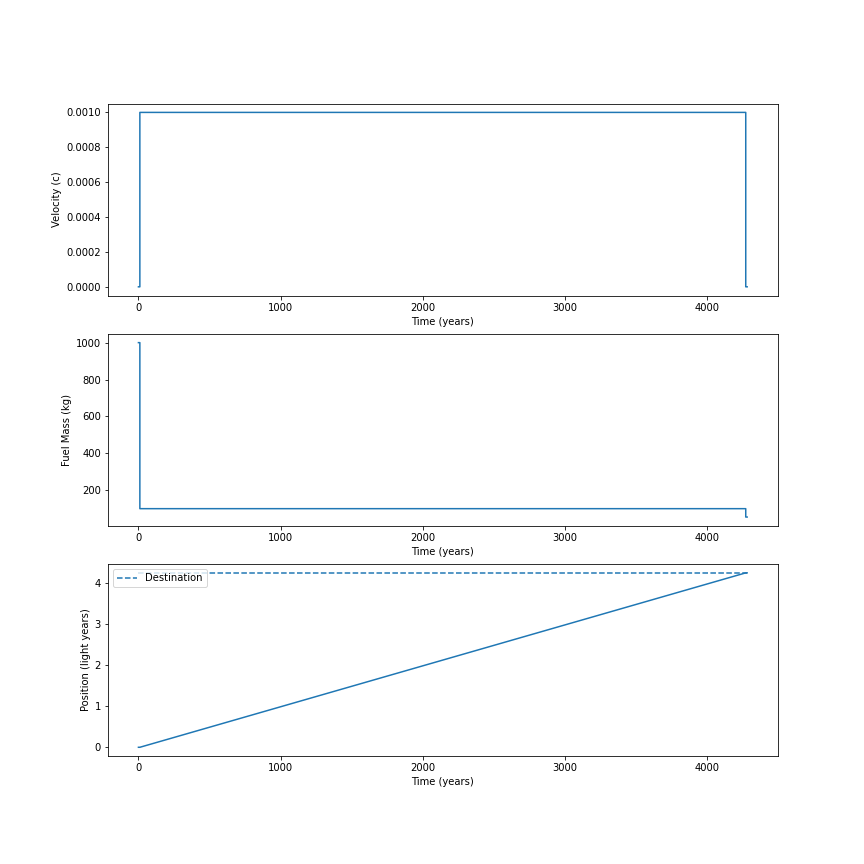

# interstellar_mission_planning
Some tools for planning interstellar missions

# Example mission

The following shows an example mission from the solar system to Proxima Centauri (4.244 light-years). We begin with a 1kg payload and 1000kg of fuel. We assume the exhaust velocity is 500km/s, which is consistent with a fusion rocket. Burning 900kg of fuel accelerates us to a cruising speed of just under 0.4 percent the speed of light (i.e. 0.004c). The trip takes more than 1100 years.

Currently, we assume that fuel escaping the suns gravity is negligible and that the mission is non-relativistic.